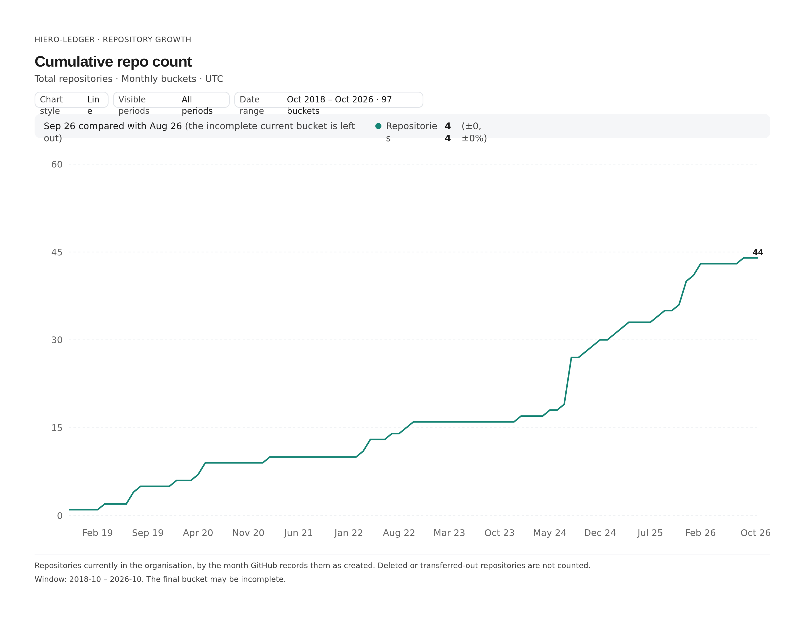
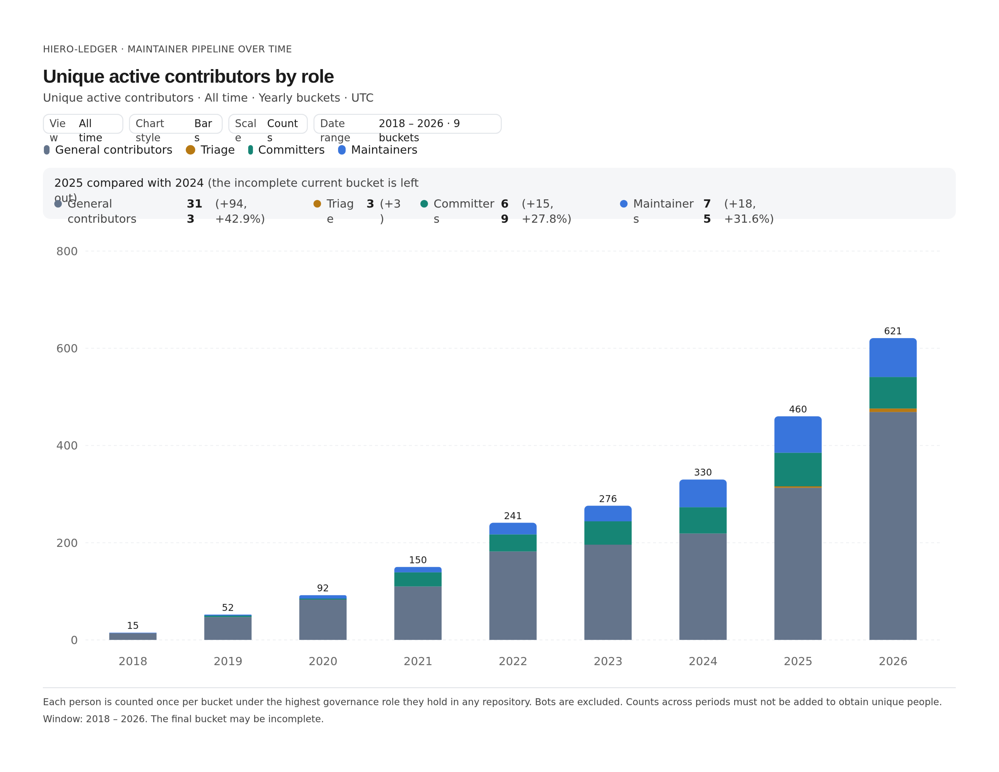
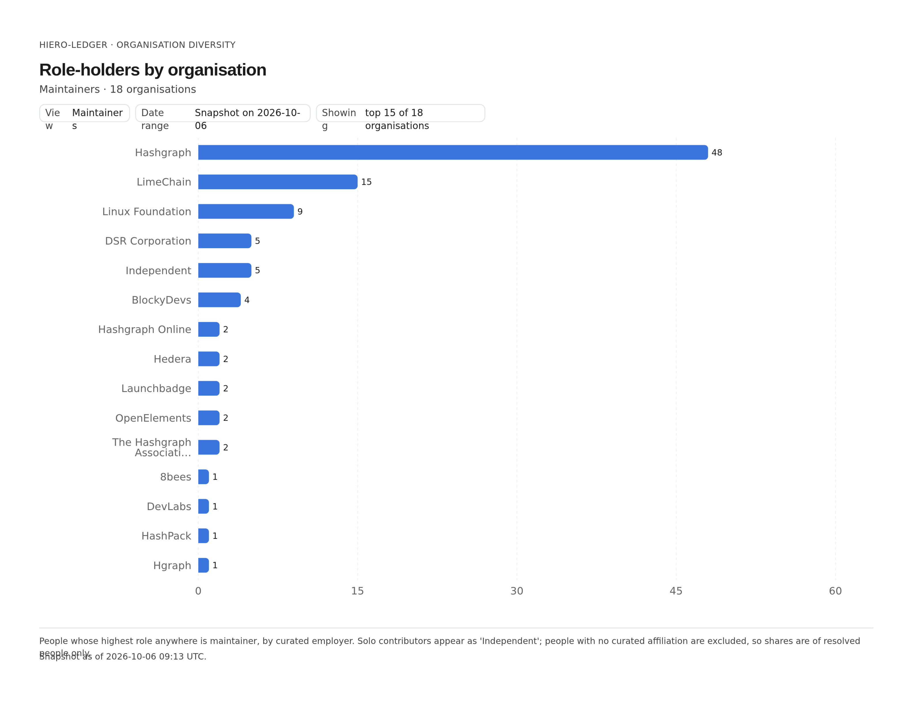

# 2027 Annual Review Hiero

## Project Health 

### GH Organization Overview

### Deliverables

### Community Calls

## Figures

<!-- Staged PNGs from the analytics dashboard. Keep the alt text; keep captions to one line. -->

*Figure 1. Cumulative Hiero repositories with a release over time. Source: [Cumulative repo count](https://analytics.hiero.org/#tab=Contributors&org=hiero-ledger&widget=repo-growth&repo-growth.slide=1).*

*Figure 2. Unique active contributors by role, per year. Source: [Unique active contributors by role](https://analytics.hiero.org/#tab=Governance&org=hiero-ledger&widget=maintainer-pipeline).*

*Figure 3. Governance role-holders by employer organisation (maintainers). Source: [Role-holders by organisation](https://analytics.hiero.org/#tab=Governance&org=hiero-ledger&widget=org-diversity&org-diversity.slide=0).*
